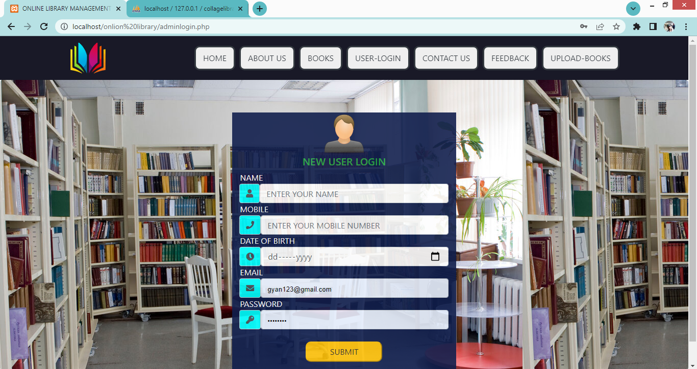

</a>

<h1>Php Library Management System</h1
this is Library management website in this website used html, css, javascript, Php, database  
 <h2> Quick Start </h2>
 <b>db ---></b> it is database folder  
 <b>for admin login ---></b> admin.php 
 <b>id---> </b>surajsrivastava044@gmail.com 
  <b>password --></b> 7860290469   

# That's all 🎊🎉 

## ScreenShots
   
   
   
   
   
   
   
   
   
   
   
   
   
   
   
   
   
   
   
   
   
   

# Thanks
  
  
